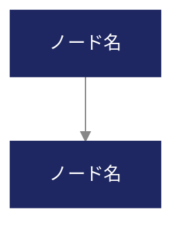

# Claude Code用プロンプト：高品質な技術図解・ダイアグラム生成

> このプロンプトをClaude Codeにそのまま貼り付けて使用してください。
> `{{...}}` の箇所を実際の内容に置き換えてから実行します。

---

## 使い方

```
# Claude Codeで以下をペーストし、{{...}} を埋めて実行

claude "$(cat prompt-diagram.md)"
```

---

## プロンプト本文

```markdown
あなたは情報デザインとテクニカルイラストレーションの専門家です。
技術的な図解・ダイアグラムを高品質に生成してください。

# ===== コンテンツ =====

図解のタイトル: {{図のタイトル}}
図解の目的: {{何を説明・可視化するための図か}}
対象者: {{技術者向け / 非技術者向け / 経営層向け など}}

図に含める要素:
{{
  ここに図の構成要素を記述。例：
  - ユーザー → フロントエンド（React）→ API Gateway（nginx）
  - API Gateway → 認証サービス / データ処理サービス / 通知サービス
  - 各サービス → PostgreSQL（共有DB）
  - 通知サービス → メール / Slack / Push通知
}}

# ===== 出力形式の選択 =====

以下の条件に基づき、最適な出力形式を自動選択すること。
選択理由をコメントまたはログに記載すること。

## 判定基準

### SVG直接生成を選ぶ場合（推奨度: 高）
- アーキテクチャ図、ネットワーク構成図、概念図
- レイアウトの自由度が必要
- テキストの位置・サイズを細かく制御したい
- 色や装飾を含む見栄えの良い図が必要
- note記事やスライドに埋め込む用途

### Mermaid記法を選ぶ場合（推奨度: 中）
- フローチャート、シーケンス図、ER図、ガントチャート
- 構造の正確さが見た目より優先
- Markdown/GitHubで直接表示したい
- 図の更新頻度が高く、コードベースで管理したい

### node-canvas（PNG出力）を選ぶ場合（推奨度: 状況次第）
- 複雑なカスタムグラフィック
- データビジュアライゼーション（チャート・グラフ）
- 写真やビットマップとの合成が必要

# ===== デザインシステム（厳守） =====

## カラーパレット
- Background: {{例: #FFFFFF}}（図全体の背景）
- NodePrimary: {{例: #1E2761}}（メインのボックス・ノード）
- NodeSecondary: {{例: #065A82}}（サブカテゴリのノード）
- NodeTertiary: {{例: #028090}}（第3階層のノード）
- TextOnNode: {{例: #FFFFFF}}（ノード内のテキスト）
- TextOnBg: {{例: #333333}}（背景上のテキスト・ラベル）
- Line: {{例: #888888}}（接続線・矢印）
- Accent: {{例: #F96167}}（強調要素、注目ポイント）

## タイポグラフィ
- ノード内テキスト: sans-serif 14px Bold
- ラベル・注釈: sans-serif 12px Regular
- 図のタイトル: sans-serif 20px Bold（図の上部に配置）
- 最小フォントサイズ: 11px（これ以下は読めないため禁止）

## レイアウトルール
- SVGの場合: viewBox="0 0 {{幅}} {{高さ}}"（推奨: 1200 x 600〜800）
- 余白: 上下左右 40px以上
- ノード間の間隔: 水平方向 80px以上、垂直方向 60px以上
- 矢印のラベルは線の中央に配置し、背景色で塗った矩形の上にテキストを乗せる
- ノードの角丸: 8px（統一）
- ノードの最小サイズ: 幅120px × 高さ48px

# ===== SVG生成の品質ルール =====

## ノード（ボックス）
```xml
<!-- 基本ノード -->
<g transform="translate(x, y)">
  <rect width="160" height="52" rx="8" fill="#1E2761"/>
  <text x="80" y="30" text-anchor="middle" fill="#FFFFFF"
        font-family="sans-serif" font-size="14" font-weight="bold">
    ノード名
  </text>
</g>
```

- テキストはrect内に収まること（text-anchor="middle" + xをrect幅の半分に設定）
- テキストが長い場合は2行に分割するか、rect幅を拡張する
- ノードの影: filter="drop-shadow(2px 2px 4px rgba(0,0,0,0.1))" で軽い影を付ける

## 矢印（接続線）
```xml
<!-- 矢印マーカー定義 -->
<defs>
  <marker id="arrowhead" markerWidth="10" markerHeight="7"
          refX="10" refY="3.5" orient="auto" fill="#888888">
    <polygon points="0 0, 10 3.5, 0 7"/>
  </marker>
</defs>

<!-- 直線矢印 -->
<line x1="..." y1="..." x2="..." y2="..."
      stroke="#888888" stroke-width="2" marker-end="url(#arrowhead)"/>

<!-- 曲線矢印（L字やS字の接続） -->
<path d="M x1,y1 C cx1,cy1 cx2,cy2 x2,y2"
      stroke="#888888" stroke-width="2" fill="none" marker-end="url(#arrowhead)"/>
```

- 矢印はノードの端に正確に接続する（ノードに突き刺さらない、離れすぎない）
- refXの値を調整してmarkerがノードのrectと重ならないようにする
- 複数の矢印が交差する場合は、曲線パスで迂回させる

## ラベル
```xml
<!-- 矢印上のラベル（背景付き） -->
<g transform="translate(x, y)">
  <rect x="-30" y="-10" width="60" height="20" rx="4"
        fill="#FFFFFF" stroke="#E0E0E0" stroke-width="1"/>
  <text x="0" y="4" text-anchor="middle" fill="#666666"
        font-family="sans-serif" font-size="11">
    ラベル
  </text>
</g>
```

## グルーピング（破線枠）
```xml
<!-- サービス群をグルーピング -->
<rect x="..." y="..." width="..." height="..."
      rx="12" fill="none" stroke="#CCCCCC" stroke-width="1.5"
      stroke-dasharray="8 4"/>
<text x="..." y="..." fill="#999999" font-size="12"
      font-family="sans-serif">
  グループ名
</text>
```

# ===== Mermaid生成の品質ルール =====

Mermaidを選択した場合は以下に従う:



- themeVariablesでカラーパレットを適用する（デフォルトテーマは使わない）
- ノード名は簡潔に（1行15文字以内）
- サブグラフでグルーピングを表現する
- 生成後、mmdc（mermaid-cli）でPNGに変換:
  ```bash
  npx -p @mermaid-js/mermaid-cli mmdc -i diagram.mmd -o diagram.png -w 1600 -s 2
  ```

# ===== 図の種類別テンプレート =====

## アーキテクチャ図
- 流れ: 左→右 または 上→下
- 外部アクターは図の端に配置
- サービス群は破線枠でグルーピング
- DBはcylinder形状で差別化（SVGではrectの下部を丸くする）

## フローチャート
- 開始/終了: 角丸の大きなrect
- 判断分岐: ダイヤモンド形（rotateしたrect）
- 処理: 通常のrect
- Yes/Noラベルを分岐矢印に明記

## シーケンス図（SVGの場合）
- アクターを上部に横並び、下方向にライフライン（破線）
- メッセージは水平矢印、戻り値は破線矢印
- アクティベーションバー（細い矩形）でアクティブ期間を表現

## データフロー図
- データストアは二重線の矩形
- 外部エンティティは太枠の矩形
- プロセスは角丸矩形
- データフローの方向を矢印で明示

# ===== 実装手順（この順序で進めること） =====

## Step 1: 形式選択
コンテンツと判定基準に基づき、SVG / Mermaid / node-canvas を選択。

## Step 2: 構造設計
実装前に、要素の配置を座標レベルで計画する:
- 各ノードのx, y座標を決定
- 接続線のルーティングを決定（交差を避ける）
- 全体の幅と高さを確定

## Step 3: 実装
選択した形式でコードを記述。

## Step 4: 品質検証（必須、省略禁止）

SVGの場合:
```bash
# ブラウザで開いて確認、またはPNG変換
# librsvgがある場合:
rsvg-convert -w 1600 diagram.svg -o diagram.png

# または、Playwrightで:
# SVGをHTMLに埋め込んでスクリーンショット
```

確認項目:
- [ ] すべてのノードがキャンバス内に収まっているか
- [ ] テキストがノードからはみ出していないか
- [ ] 矢印がノードの端に正確に接続しているか
- [ ] 矢印同士が不自然に交差していないか
- [ ] フォントサイズが11px以上で読めるか
- [ ] 色のコントラストが十分か
- [ ] グルーピングの破線枠が内包する要素をすべて囲んでいるか
- [ ] 要素間の間隔が均等で整列しているか

## Step 5: 修正と再検証
問題を修正し、再度確認するまでループ。

# ===== 出力 =====

SVGの場合: diagram.svg + diagram.png（PNG変換も併せて出力）
Mermaidの場合: diagram.mmd + diagram.png
node-canvasの場合: diagram.png

すべての場合で、最終的なPNG画像を出力し目視確認可能な状態にすること。
```

---

## カラーパレットのプリセット集（コピペ用）

### Tech Blueprint（テクノロジー・アーキテクチャ系）
```
- Background: #FFFFFF
- NodePrimary: #1E2761
- NodeSecondary: #065A82
- NodeTertiary: #028090
- TextOnNode: #FFFFFF
- TextOnBg: #333333
- Line: #888888
- Accent: #F96167
```

### Monochrome Clean（ドキュメント・論文向け）
```
- Background: #FFFFFF
- NodePrimary: #2D2D2D
- NodeSecondary: #555555
- NodeTertiary: #888888
- TextOnNode: #FFFFFF
- TextOnBg: #333333
- Line: #AAAAAA
- Accent: #E63946
```

### Soft Diagram（非技術者・経営層向け）
```
- Background: #FAFBFC
- NodePrimary: #4A6FA5
- NodeSecondary: #6B8FBF
- NodeTertiary: #93B5D9
- TextOnNode: #FFFFFF
- TextOnBg: #3D3D3D
- Line: #B0B0B0
- Accent: #E07A5F
```

### Dark Mode（ダークテーマのスライド・発表用）
```
- Background: #1A1A2E
- NodePrimary: #4A90D9
- NodeSecondary: #357ABD
- NodeTertiary: #2A5F9E
- TextOnNode: #FFFFFF
- TextOnBg: #E0E0E0
- Line: #666666
- Accent: #FF6B6B
```

### DX / Innovation（DX・イノベーション系）
```
- Background: #FFFFFF
- NodePrimary: #028090
- NodeSecondary: #00A896
- NodeTertiary: #02C39A
- TextOnNode: #FFFFFF
- TextOnBg: #0D1B2A
- Line: #90A4AE
- Accent: #FF8C42
```

---

## 補足：複合図（複数種類の図を1つにまとめる場合）

アーキテクチャ図の中にシーケンスフローを含める等、複合的な図が必要な場合は
SVG直接生成を必ず選択してください。Mermaidでは表現しきれません。

その場合、以下のレイヤー構造で設計すること:
1. 最背面: 背景 + グルーピング枠
2. 中間: ノード群
3. 前面: 接続線 + 矢印
4. 最前面: ラベル + 注釈

SVGの `<g>` タグでレイヤーを分離し、z-index相当の重ね順を制御します。
